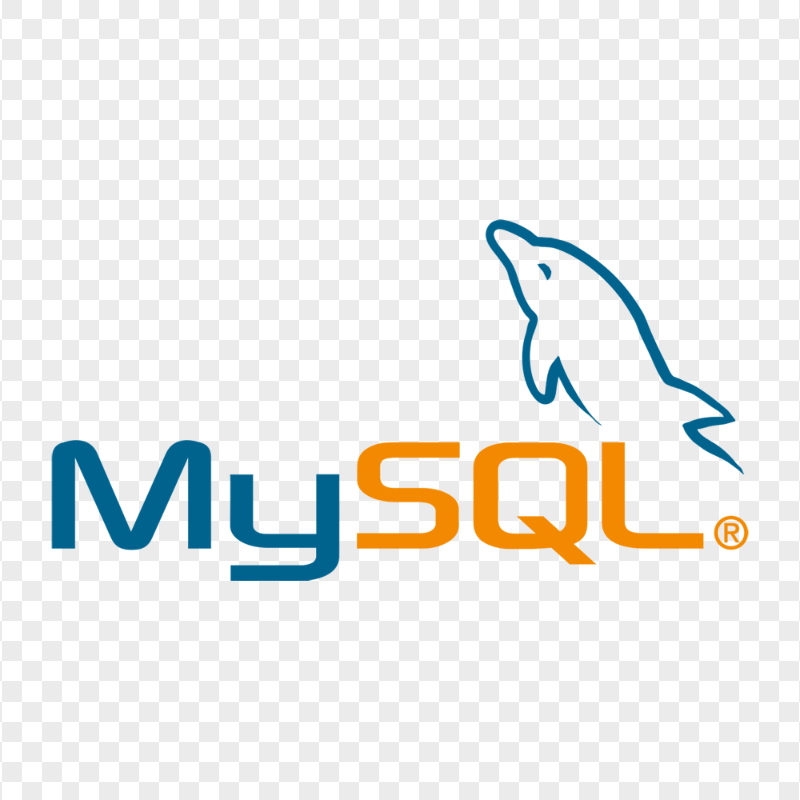

<h1 align="center">Hi 👋, I'm Sai Vamshi Miryalkar</h1>

<h3 align="center">Data Analyst | Aspiring Data Scientist | IIT Madras BS in Data Science & Applications</h3>

---

## 🚀 About Me

🎓 Pursuing **Data Science & Applications** from **IIT Madras**

📊 Passionate about Data Analytics, Business Intelligence, Machine Learning and Data Visualization

💡 Skilled in transforming raw data into actionable business insights

📈 Experienced in building dashboards, KPI reports, customer analytics and predictive models

🌱 Currently learning Advanced Data Science, Machine Learning and DSA

---

## 🛠️ Skills & Tech Stack

### Programming Languages

### Data Science & Analytics

### Visualization & BI

### Tools & Platforms

## 📂 Featured Projects
<table>
<tr>
<th>Logo</th>
<th>Project</th>
<th>Description</th>
</tr>

<tr>
<td></td>
<td>Telecom Customer Churn Analysis</td>
<td>End-to-end churn prediction using Python, SQL & Power BI</td>
</tr>

<tr>
<td></td>
<td>Banking Customer Analytics Dashboard</td>
<td>Customer insights, KPI reporting and business analytics</td>
</tr>

<tr>
<td></td>
<td>Apple Stock Market Analysis</td>
<td>Financial trend analysis using Python, Pandas & NumPy</td>
</tr>

<tr>
<td></td>
<td>SQL Projects</td>
<td>Advanced SQL querying and analytics</td>
</tr>

<tr>
<td></td>
<td>DSA in C++</td>
<td>Data Structures & Algorithms implementation</td>
</tr>

</table>

## 📚 Education

### Indian Institute of Technology Madras (IIT Madras)

**Bachelor of Science in Data Science & Applications** *(Pursuing)*

**Relevant Coursework:**
- Python Programming
- Statistics
- Data Analysis
- Machine Learning
- Database Management Systems
- Business Analytics
- Data Structures & Algorithms
- SQL & Database Design

## 🎯 Career Objective

Aspiring Data Analyst and Data Scientist seeking opportunities to leverage analytical thinking, programming skills, and business intelligence expertise to solve real-world business problems through data-driven decision making.

---

## 📫 Connect With Me

💼 LinkedIn: www.linkedin.com/in/sai-vamshi-miryalkar-b850703ba

📧 Email: saivamshimiryalkar@gmail.com

🐙 GitHub: github.com/svm-knocks

---

⭐ Turning Data into Decisions | Building Analytics Solutions | Continuous Learning
